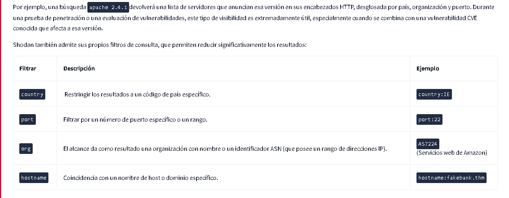
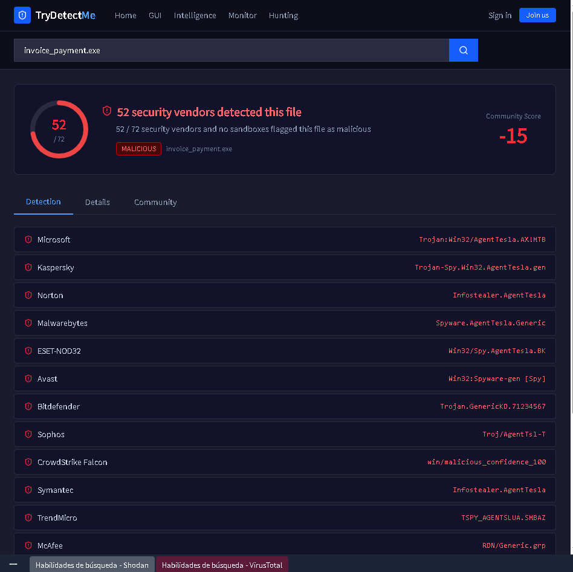
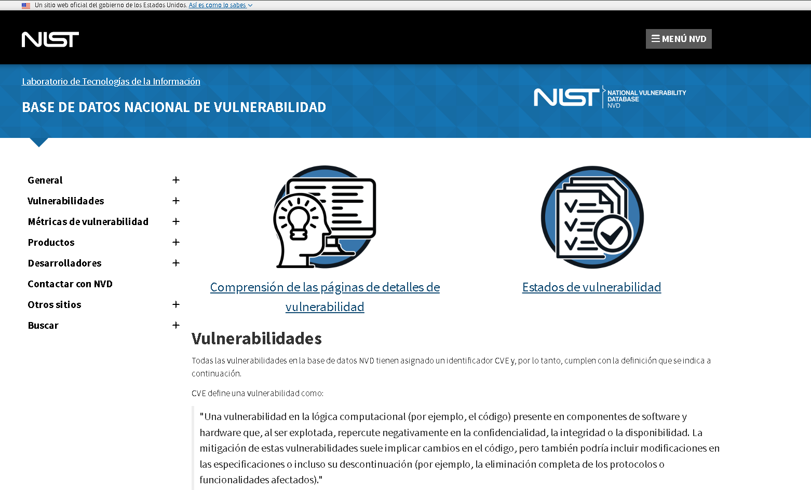
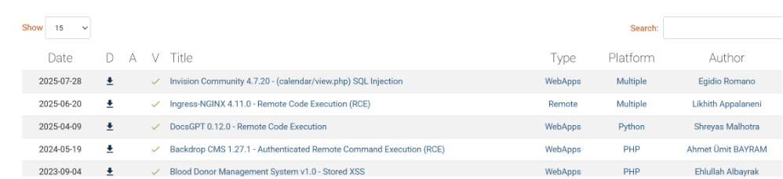
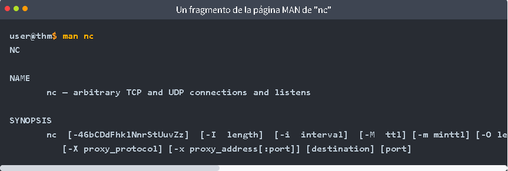

# Dirb

## ¿Que es el codigo Dirb y para que sirve?
Un error común que cometen los sitios web es dejar páginas ocultas accesibles. Se usa la terminal para ejecutar dirb que las busque (Paginas ocultas de una web).

Dentro de la terminal, se usa el  "dirb"+comando . Las líneas de la salida que empiecen con + son páginas que se han encontrado.

dirb http://fakebank.thm
Dirb encontrará dos URL. Utilice esta información para responder a la pregunta que aparece a continuación.

## Ejemplo
dirb http://fakebank.thm

# Shodan

## ¿Que es Shodan y para que sirve?
Shodan se describe a menudo como un motor de búsqueda para el Internet de las cosas (IoT), pero eso no le hace justicia. Shodan escanea continuamente internet, buscando equipos de red, sistemas de control industrial, cámaras de tráfico y prácticamente cualquier otra cosa con conexión a una red pública para ver qué está funcionando y dónde.

# VirusTotal

## ¿Que es VirusTotal y para que sirve?
VirusTotal recopila los resultados de más de 70 motores antivirus y escáneres de sitios web en una sola interfaz. Introduce un archivo, una URL, un dominio o un hash de archivo. VirusTotal te indicará si alguno de esos motores lo ha marcado como malicioso o no, (archivos, enlaces o direcciones IP) para ver si son maliciosos.No es un antivirus en tu PC; es un servicio en la nube que compara lo que subes contra muchos motores de seguridad.

## Ejemplo
Busca el archivo invoice_payment.exe en TryDetectMe (VirusTotal).

# Vulnerability Databases (CVE)

## ¿Ques es Vulnerability Databases y para que sirve?
Las  vulnerabilidades y exposiciones comunes (CVE) es lo más parecido que tiene la industria a un diccionario universal de vulnerabilidades conocidas, alli se pueden buscar las vulnerabilidades mas conocidas.

A cada vulnerabilidad confirmada se le asigna un identificador único con el formato  CVE-YEAR-NUMBER, como CVE-2025-55182. Si la vulnerabilidad tiene un impacto suficiente, incluso puede recibir un sobrenombre. Es posible que haya oído hablar de vulnerabilidades como Heartbleed, React2Shell y Log4Shell. A estas vulnerabilidades se les asigna una puntuación  (CVSS) basada en diversos factores, como:

Impacto:  ¿Qué daños puede ocasionar esta vulnerabilidad?
Complejidad : ¿Es fácil explotar la vulnerabilidad o no? 
Disponibilidad : ¿Qué probabilidades hay de que alguien pueda explotar esto?

# Documentacion Técnica

## Documentación de productos y herramientas
Cada herramienta o plataforma de seguridad importante proporciona su propia documentación, que es la más fiable y actualizada que cualquier tutorial de terceros.
Cuando se trata de solucionar problemas de comportamiento inesperado o de comprender cómo usar una herramienta de una manera determinada, la documentación oficial siempre debe ser lo primero que se consulte, no lo último.
## LinuxPáginas del hombre
¿Alguna vez te has encontrado con una herramienta o comando de línea de comandos con el que no estabas familiarizado? Linux Las páginas MANUAL te respaldan. Estas páginas sirven como documentación que puedes leer dentro de tu terminal acerca de cualquier comando en Linuxy la mayoría de las herramientas de ciberseguridad.

Para ver la página del manual, ejecute man <command>. Por ejemplo:

